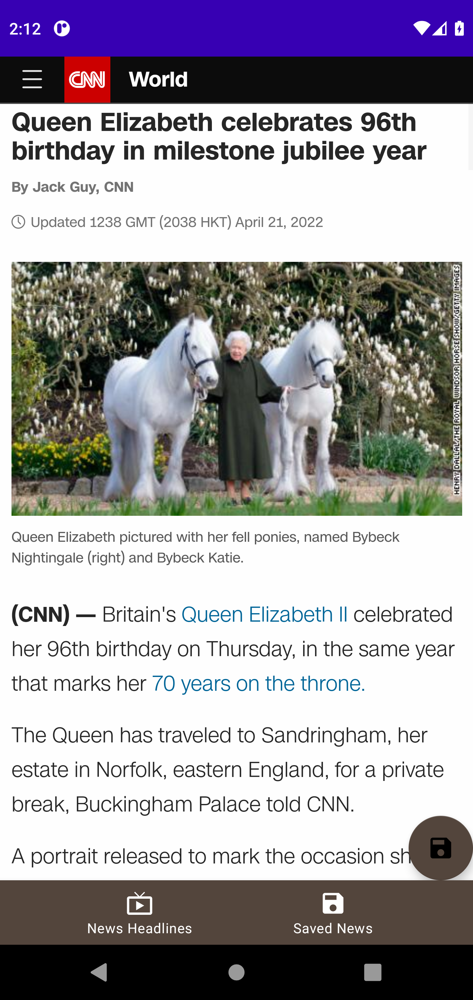
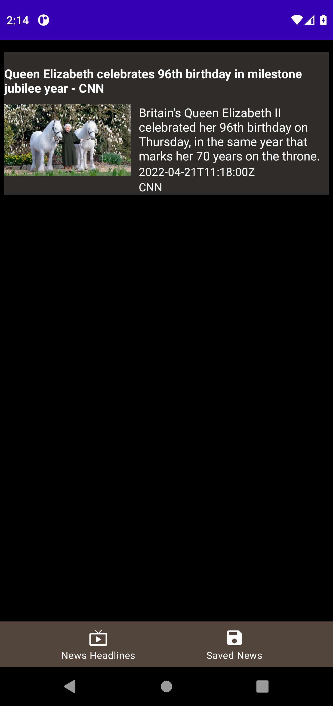

# ⚠️ 주의사항
[NewsAPI](https://newsapi.org/) 에서 얻은 API Key를 `gradle-properties` 파일에 추가해야합니다.

# MVVM-Clean-Architecture-Example-2
  
Top Headline 뉴스 불러오기 
클릭 시 웹뷰로 뉴스 불러오기 
저장한 뉴스 불러오기 
검색한 뉴스 불러오기 

# 결과화면
|Screenshot1|Screenshot2|
|---|---|
|||
|||

 

# 배운 내용 정리
- MVVM
- Clean Architecture
- Hilt
- Retrofit
- Coroutine
- ViewModel
- LiveData
- Usecase
- Repository
- Room
